# XRPL Institutional Fund Management Protocol

[](https://opensource.org/licenses/MIT)
[](https://xrpl.org)
[](https://convex.dev)
[](https://reactjs.org)

## 🚀 Overview

The **XRPL Institutional Fund Management Protocol** is a comprehensive, institutional-grade platform designed to bridge traditional finance (TradFi) with decentralized finance (DeFi) on the XRP Ledger. It enables asset managers to create, manage, and distribute tokenized funds with built-in compliance, automated reporting, and seamless settlement.

This platform leverages the latest XRPL amendments including **XLS-33 (Multi-Purpose Tokens)**, **XLS-40 (DID)**, **XLS-65 (Lending Protocol)**, and **XLS-80 (Permissioned Domains)** to provide a secure and regulatory-compliant environment for institutional capital.

---

## 🏗️ System Architecture

The system is built on a modern stack utilizing React for the frontend, Convex for the reactive backend, and the XRP Ledger for settlement and asset management.

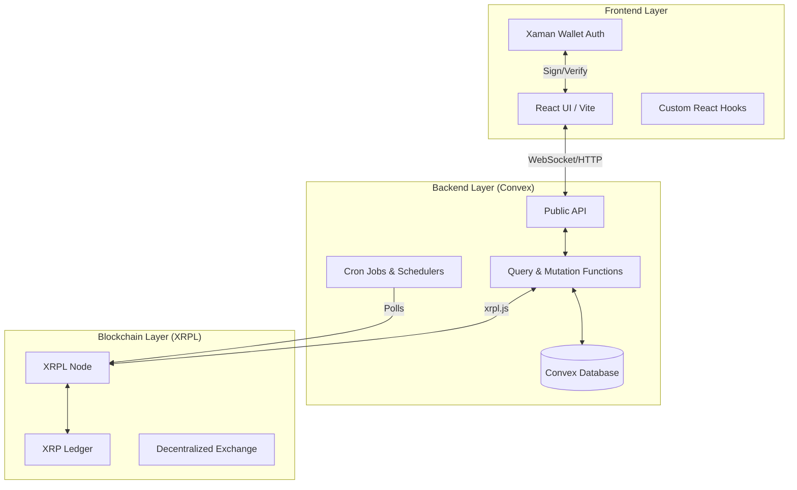

---

## 💾 Database Schema (ERD)

The data model is designed to handle complex relationships between funds, investors, and assets while maintaining strict compliance records.

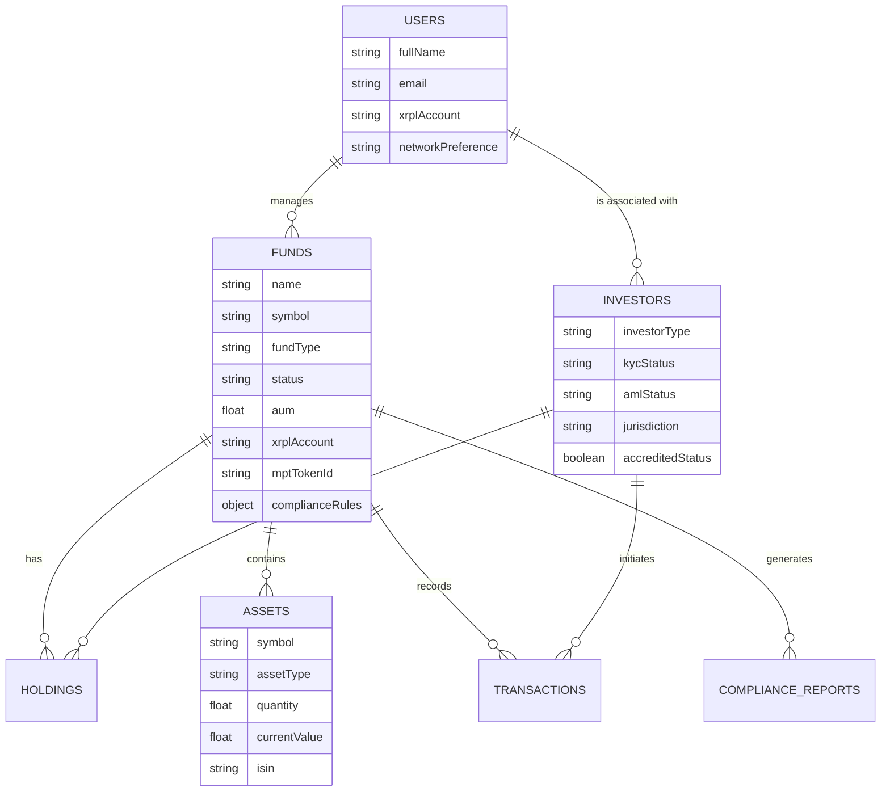

---

## 🔐 Authentication Flow

Secure authentication using Xaman (formerly Xumm) Wallet ensures that all actions are cryptographically signed by the user's XRPL account.

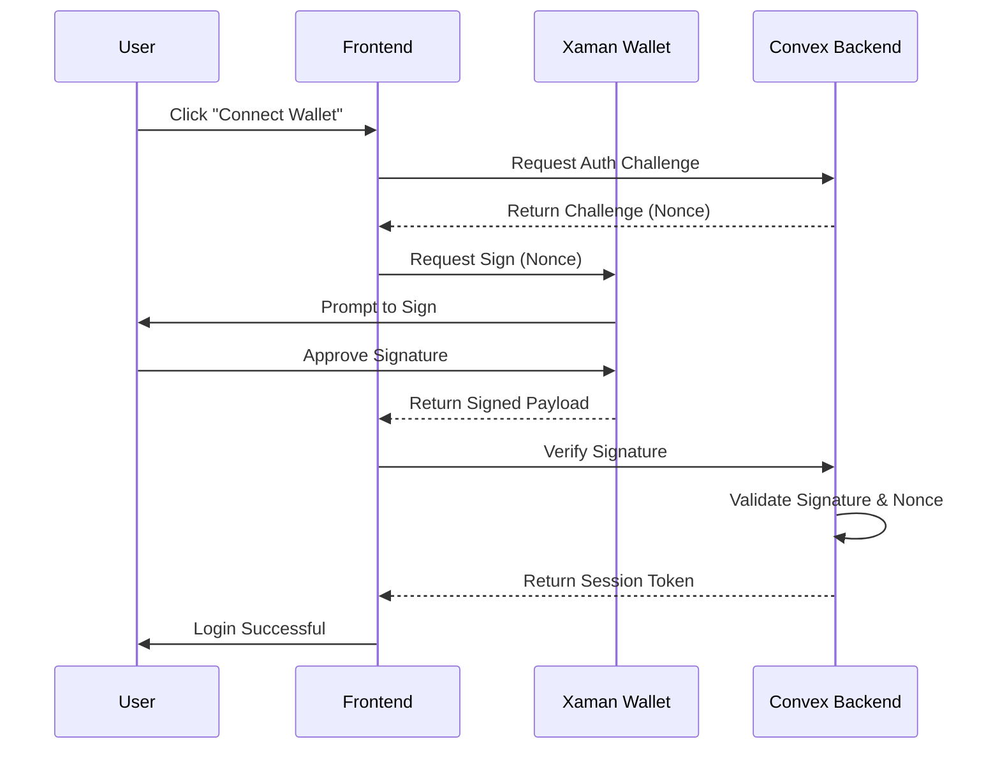

---

## 🔄 Fund Creation Lifecycle

The lifecycle of a fund from inception to active management, involving multiple compliance checks and on-chain instantiation.

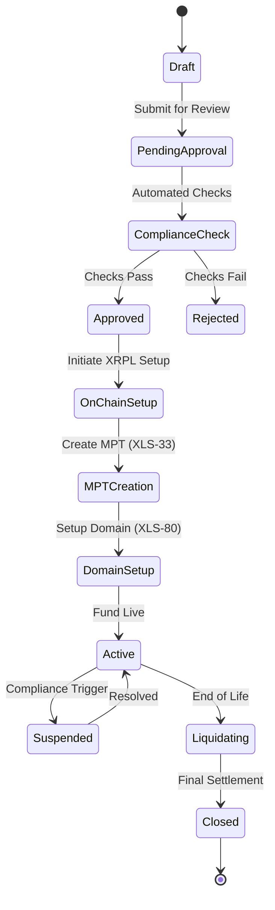

---

## 💰 Investment Subscription Flow

The process for an investor to subscribe to a fund, including KYC validation and token issuance.

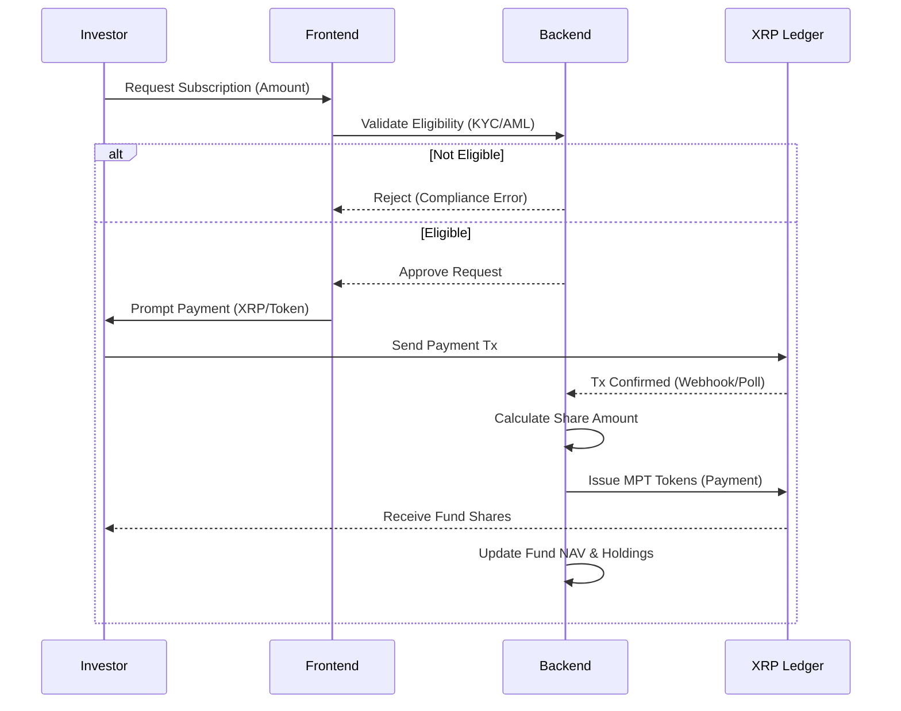

---

## 💸 Redemption Flow

The process for an investor to redeem their shares for the underlying asset or base currency.

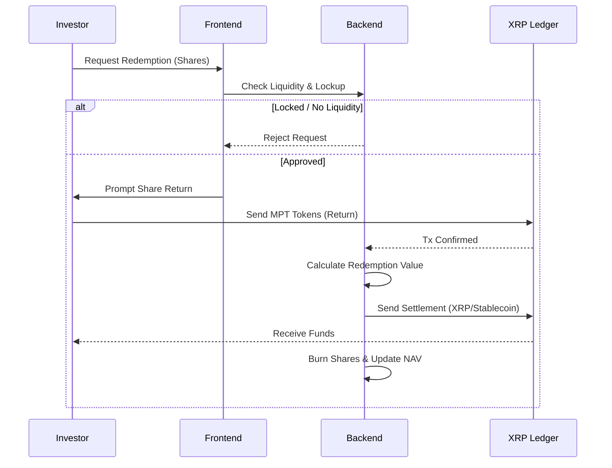

---

## 🏦 Lending Protocol (XLS-65)

Integration with the native XRPL Lending Protocol for yield generation and leverage.

```mermaid
flowchart TD
    Start[Start] --> CreatePool[Create Loan Broker (Pool)]
    CreatePool --> SetTerms[Set Interest & Collateral Terms]
    SetTerms --> ActivePool{Pool Active?}
    
    ActivePool -- Yes --> Borrower[Borrower Request]
    ActivePool -- No --> Error[Error]

    Borrower --> CheckCollateral{Sufficient Collateral?}
    CheckCollateral -- Yes --> CreateLoan[Create Loan Object]
    CheckCollateral -- No --> Reject[Reject Request]

    CreateLoan --> FundLoan[Lender Funds Loan]
    FundLoan --> ActiveLoan[Loan Active]
    
    ActiveLoan --> Repay{Repayment?}
    Repay -- Full --> CloseLoan[Close Loan & Return Collateral]
    Repay -- Partial --> UpdateLoan[Update Balance]
    
    ActiveLoan --> Default{Default Condition?}
    Default -- Yes --> Liquidate[Liquidate Collateral]
    Liquidate --> CloseLoan
```

---

## 🛡️ Permissioned Domains (XLS-80)

Using XLS-80 to enforce strict access control for institutional funds.

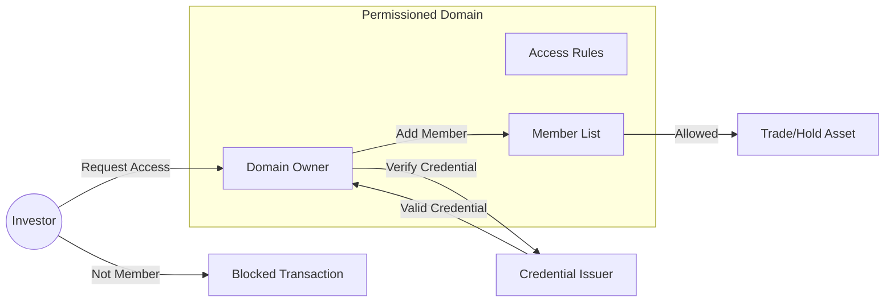

---

## 🆔 DID Identity Verification (XLS-40)

Decentralized Identity implementation for self-sovereign compliance.

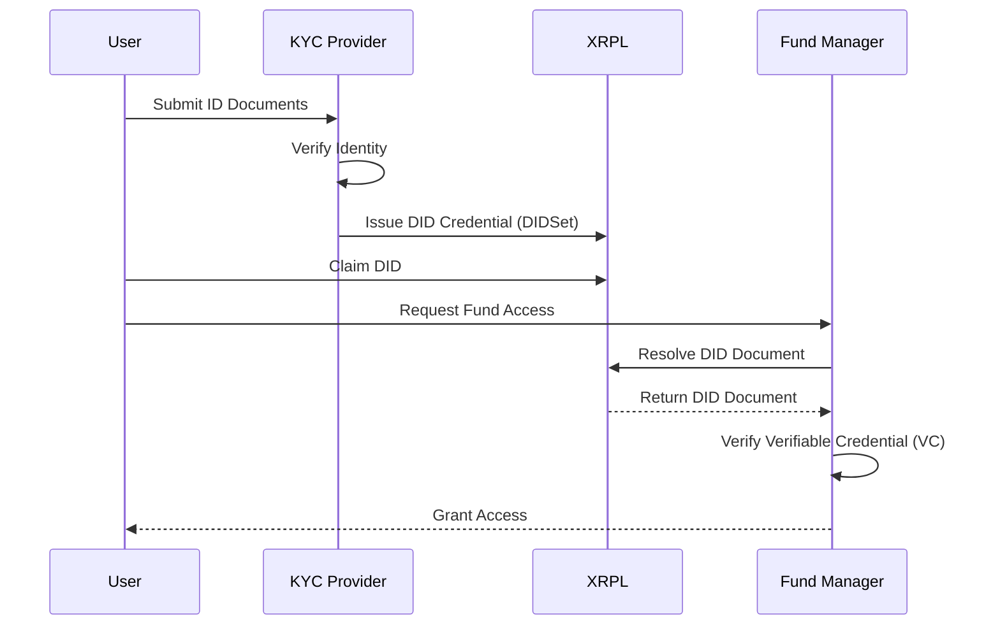

---

## ✅ Compliance Workflow

Automated compliance engine ensuring all transactions meet regulatory standards.

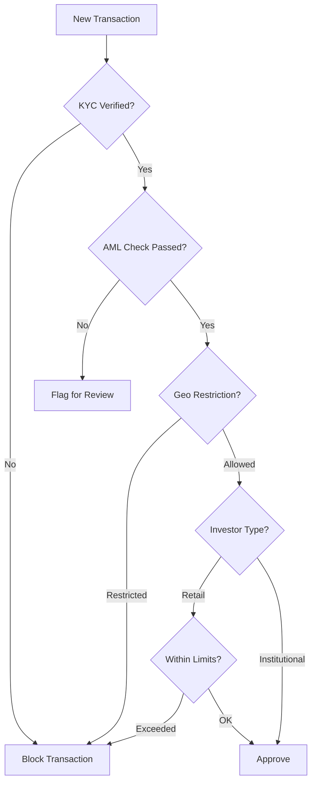

---

## ⚖️ Portfolio Rebalancing

Logic for maintaining target asset allocations.

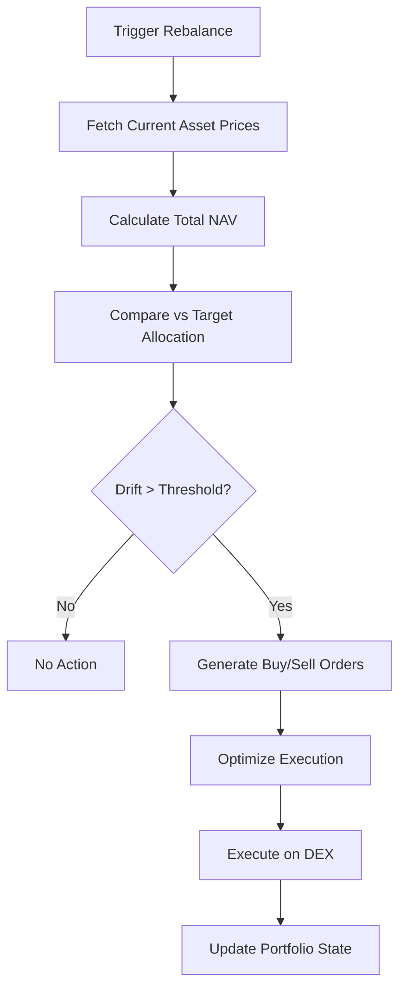

---

## 🤝 Settlement Process

End-to-end settlement flow for fund subscriptions and redemptions.

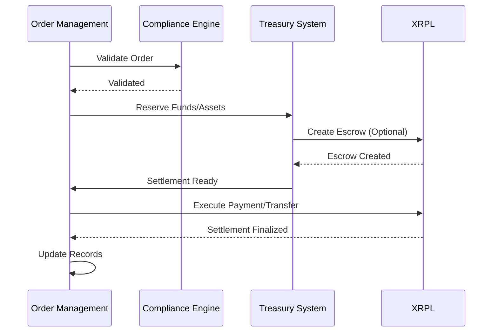

---

## 🔌 XRPL Interaction Layer

How the application interfaces with the XRP Ledger.

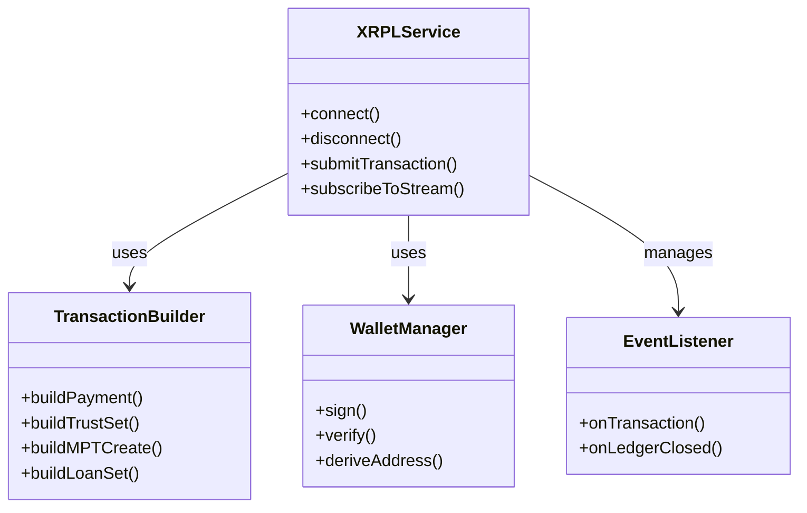

---

## ⚛️ Frontend Component Hierarchy

Structure of the React application.

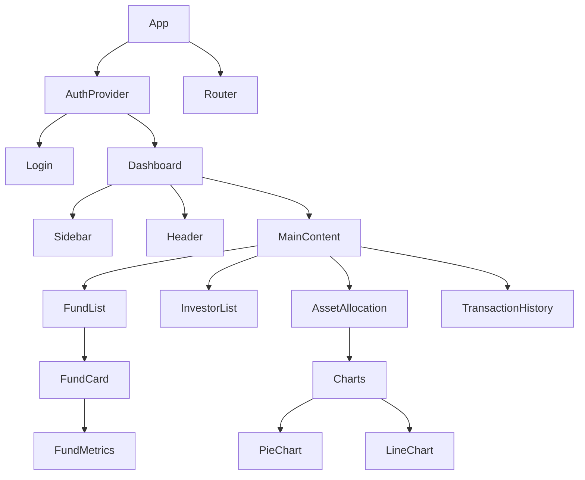

---

## 🔔 Notification System

Event-driven notification architecture.

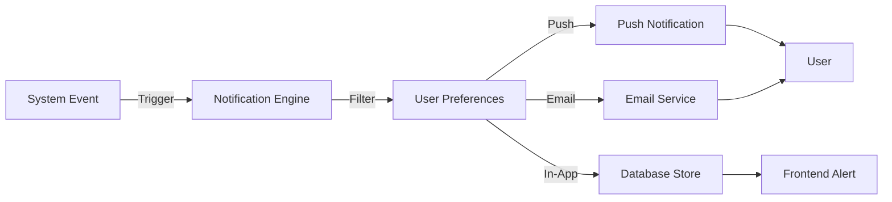

---

## 📉 Risk Management

Calculation of risk metrics for funds.

```mermaid
graph TD
    Data[Historical Data] --> Returns[Calculate Returns]
    Returns --> Volatility[Calculate Volatility]
    Returns --> VaR[Calculate VaR (95% & 99%)]
    Returns --> Drawdown[Calculate Max Drawdown]
    
    Benchmark[Benchmark Data] --> Beta[Calculate Beta]
    Benchmark --> Alpha[Calculate Alpha]
    
    Volatility --> Sharpe[Sharpe Ratio]
    Volatility --> Sortino[Sortino Ratio]
    
    VaR --> Report[Risk Report]
    Drawdown --> Report
    Sharpe --> Report
```

---

## 📝 Audit Trail

Immutable logging of all system actions.

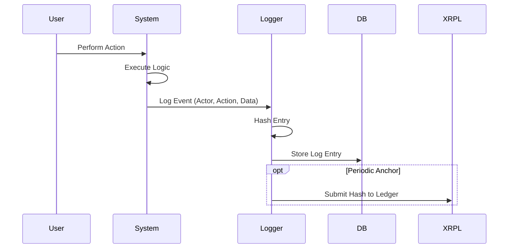

---

## 🛠️ Getting Started

### Prerequisites
- Node.js v18+
- npm or yarn

### Installation

```bash
# Clone the repository
git clone https://github.com/MrDecryptDecipher/xrpl-institutional-fund-management.git

# Install dependencies
npm install

# Start the development server
npm run dev
```

### Testing

```bash
# Run all tests
npm test

# Run specific integration tests
npm run test:integration
```

---

## 📄 License

This project is licensed under the MIT License - see the [LICENSE](LICENSE) file for details.