# XRPL Institutional Fund Management Protocol

[](https://opensource.org/licenses/MIT)
[](https://xrpl.org)
[](https://convex.dev)
[](https://reactjs.org)

## 🚀 Overview

The **XRPL Institutional Fund Management Protocol** is a state-of-the-art financial infrastructure designed to bridge the gap between Traditional Finance (TradFi) and Decentralized Finance (DeFi). Built on the **XRP Ledger (XRPL)**, it empowers asset managers to launch, manage, and settle tokenized funds with institutional-grade compliance, security, and efficiency.

Unlike standard DeFi protocols, this system is built from the ground up for **regulated markets**, leveraging specific XRPL amendments to ensure every transaction is compliant, every identity is verified, and every asset is secure.

### 🌟 Key Value Propositions

*   **Regulatory Compliance First**: Built-in automated KYC/AML checks using **XLS-80 (Permissioned Domains)** and **XLS-40 (DID)** ensure that only verified counterparties can hold or trade fund tokens.
*   **Institutional Lending**: Integrated **XLS-65 (Native Lending Protocol)** allows funds to securely lend assets or borrow against collateral without intermediaries.
*   **Real-Time Settlement**: Leveraging XRPL's 3-second ledger close time for near-instant subscription and redemption settlement.
*   **Reactive Architecture**: Powered by **Convex**, the backend provides real-time state synchronization between the blockchain and the user interface, eliminating stale data.

---

## 🏗️ System Architecture

The architecture follows a reactive, event-driven pattern. The **Convex** backend acts as the synchronization layer between the deterministic **XRP Ledger** and the dynamic **React** frontend.

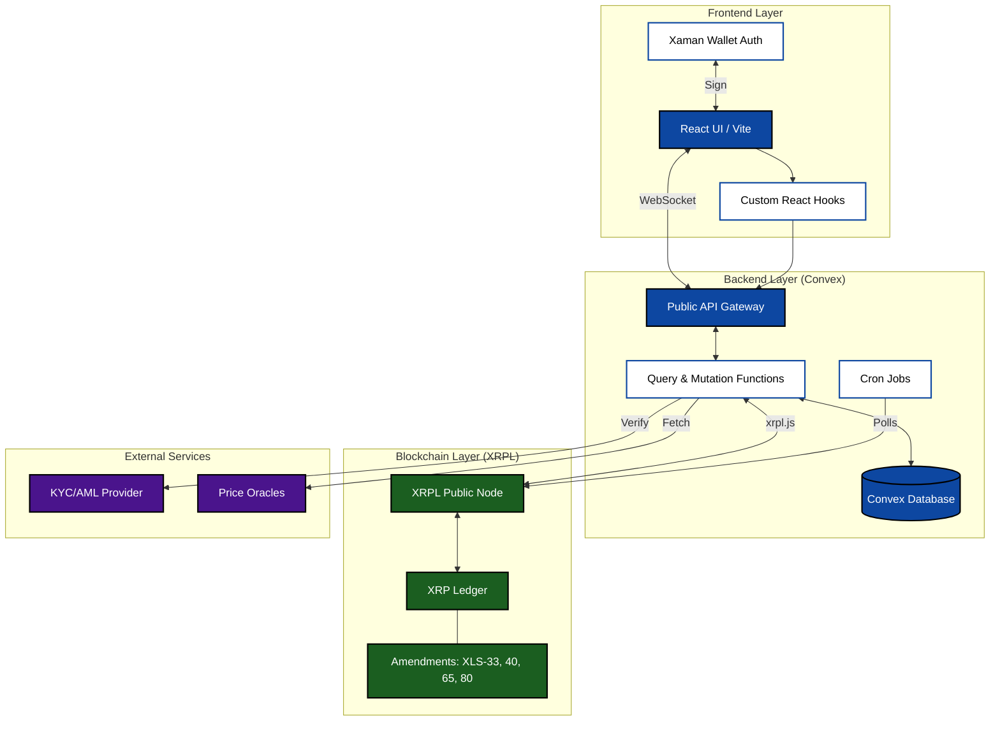

---

## 💾 Database Schema (ERD)

Our data model bridges off-chain metadata with on-chain state. While the XRPL is the source of truth for balances, Convex stores rich metadata, compliance records, and historical performance data.

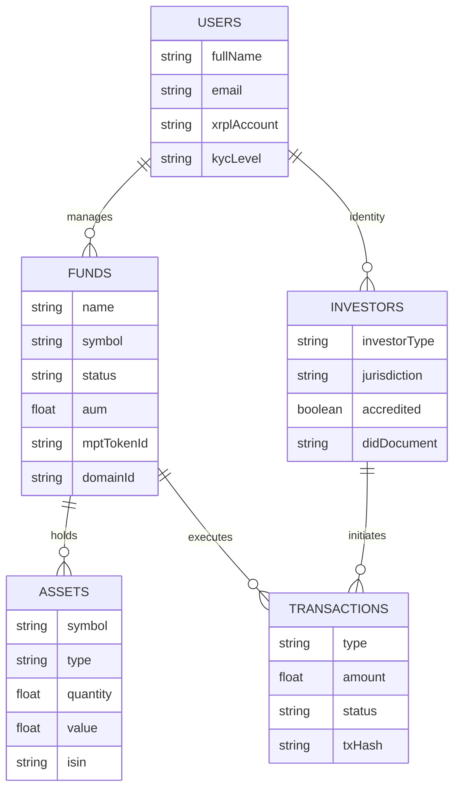

---

## 🔐 Authentication Flow

We utilize **Xaman (formerly Xumm)** for non-custodial authentication. This ensures that the platform never holds user keys. Authentication is a cryptographic handshake proving ownership of an XRPL account.

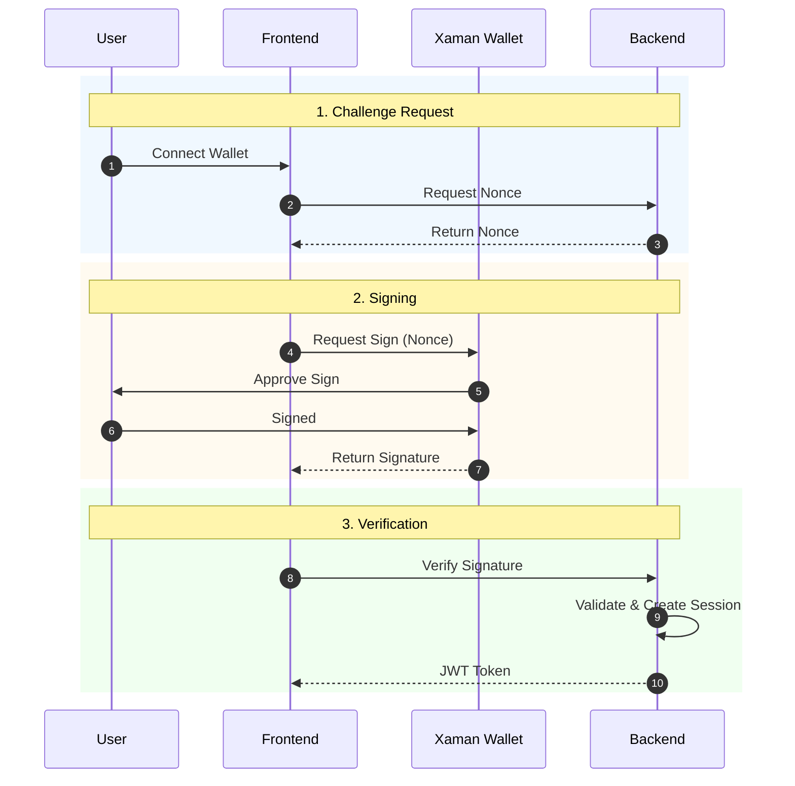

---

## 🔄 Fund Creation Lifecycle

The fund creation process is a rigorous workflow ensuring all regulatory requirements are met before the fund is deployed on-chain.

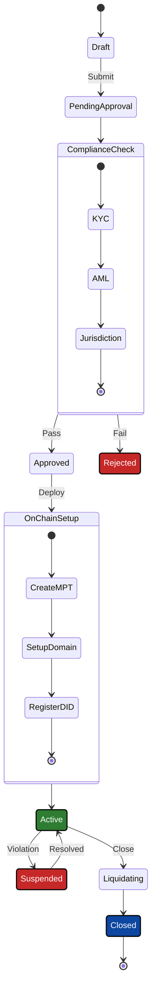

---

## 💰 Investment Subscription Flow

Investors subscribe to funds using a seamless flow that handles KYC verification and token issuance in a single atomic process.

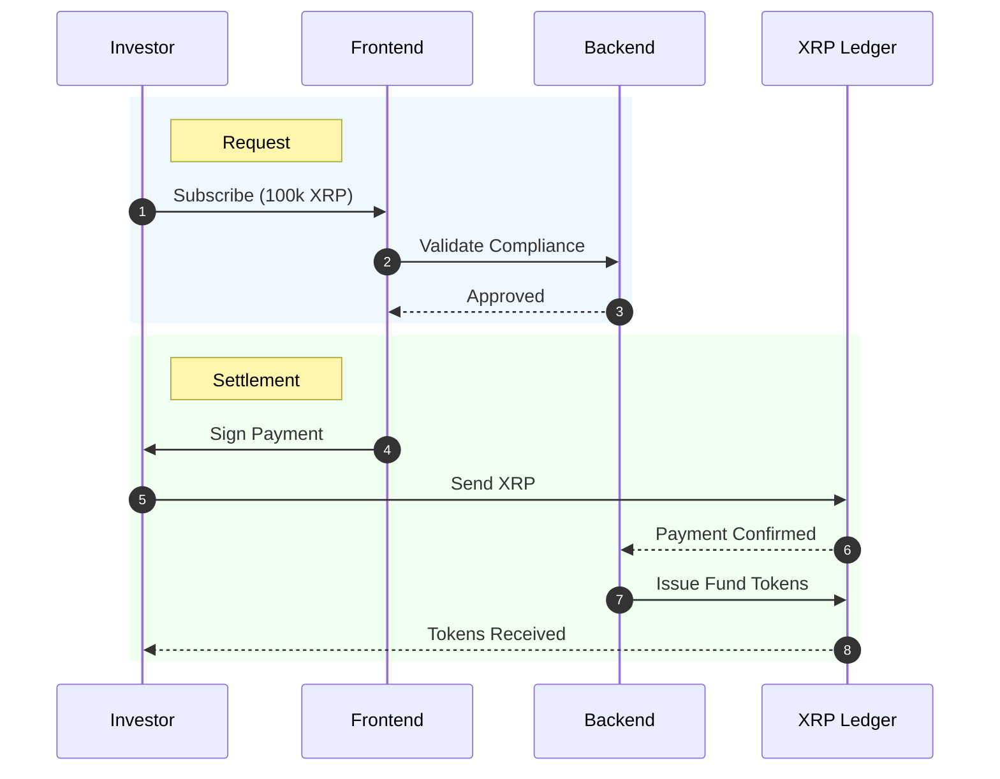

---

## 💸 Redemption Flow

Redemptions are automated but subject to liquidity and lock-up period checks.

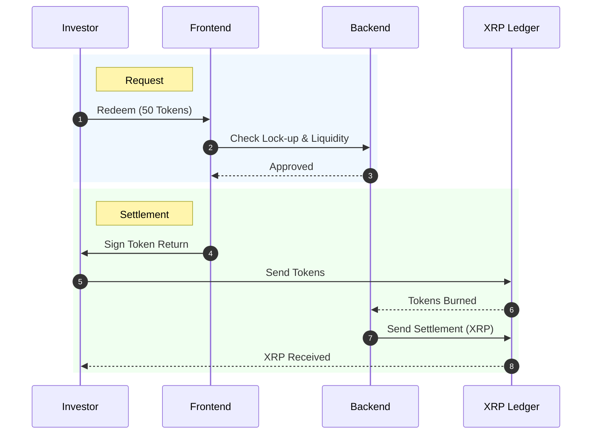

---

## 🏦 Lending Protocol (XLS-65)

We integrate the native **XLS-65 Lending Protocol** to allow funds to earn yield on idle assets.

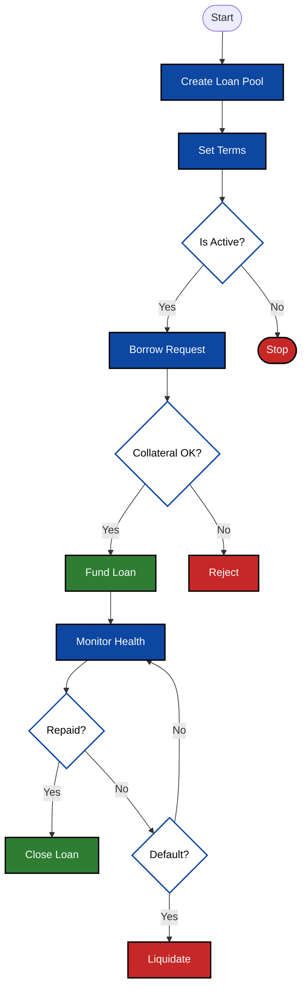

---

## 🛡️ Permissioned Domains (XLS-80)

**XLS-80** is the backbone of our compliance layer, ensuring that tokens can only be held by authorized wallets.

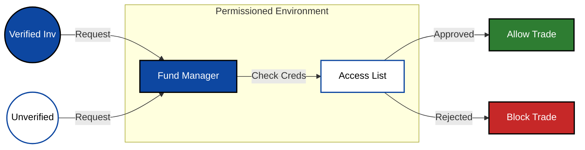

---

## 🆔 DID Identity Verification (XLS-40)

We use **Decentralized Identifiers (DIDs)** to link on-chain accounts to off-chain identity documents without exposing sensitive data.

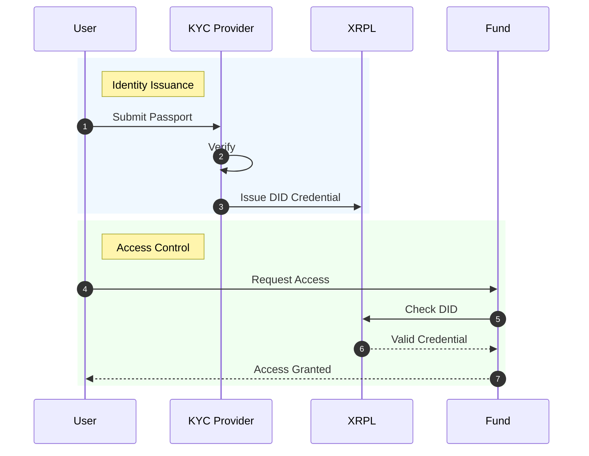

---

## ✅ Compliance Workflow

Every transaction passes through a multi-stage compliance engine.

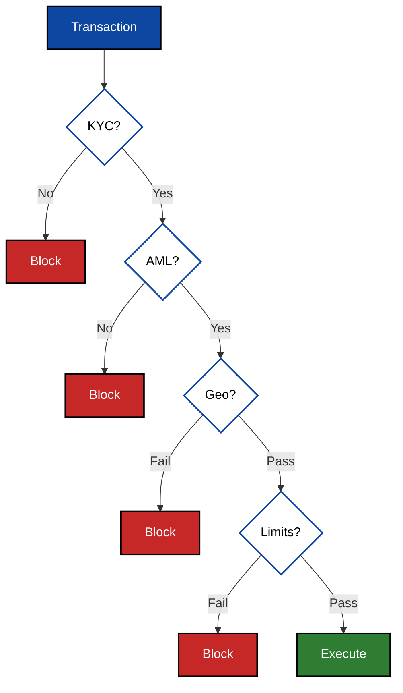

---

## ⚖️ Portfolio Rebalancing

Automated rebalancing ensures the fund maintains its target asset allocation.

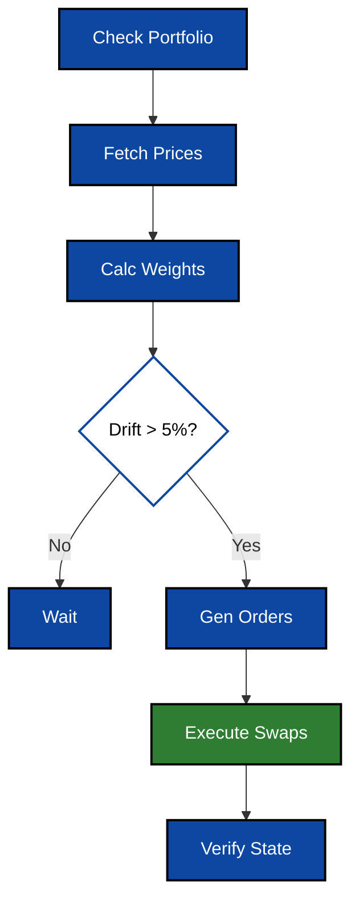

---

## 🤝 Settlement Process

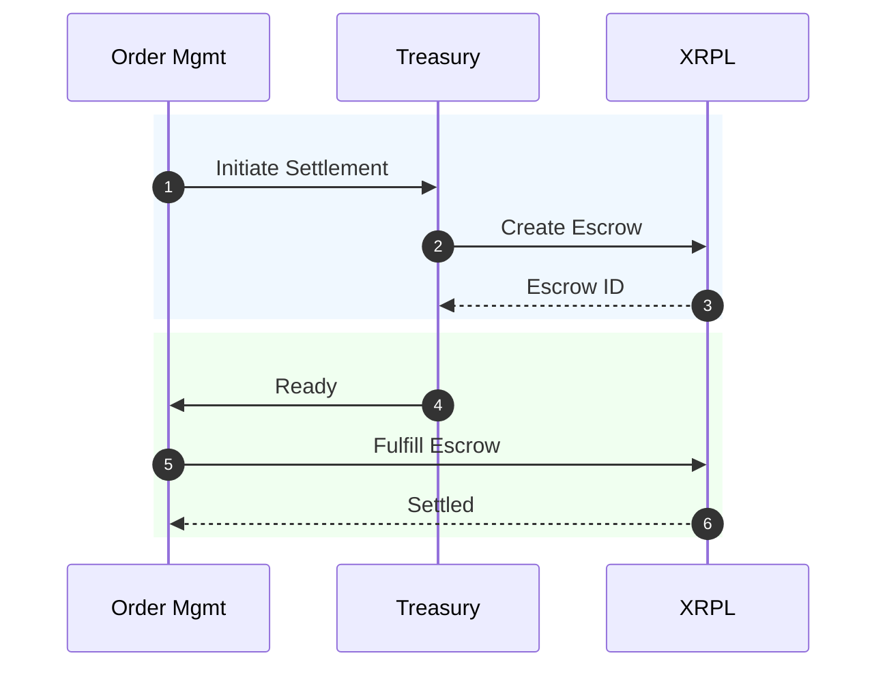

---

## 🔌 XRPL Interaction Layer

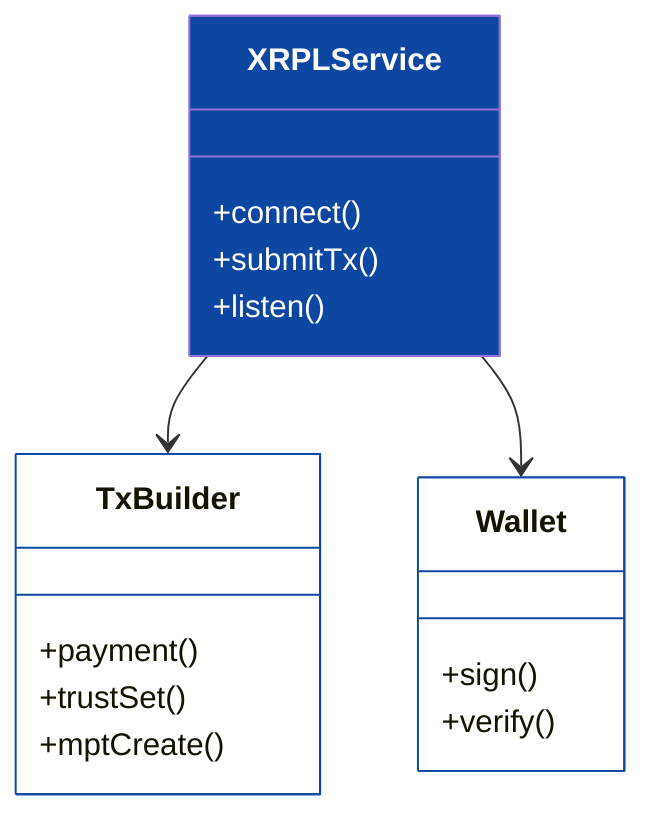

---

## ⚛️ Frontend Component Hierarchy

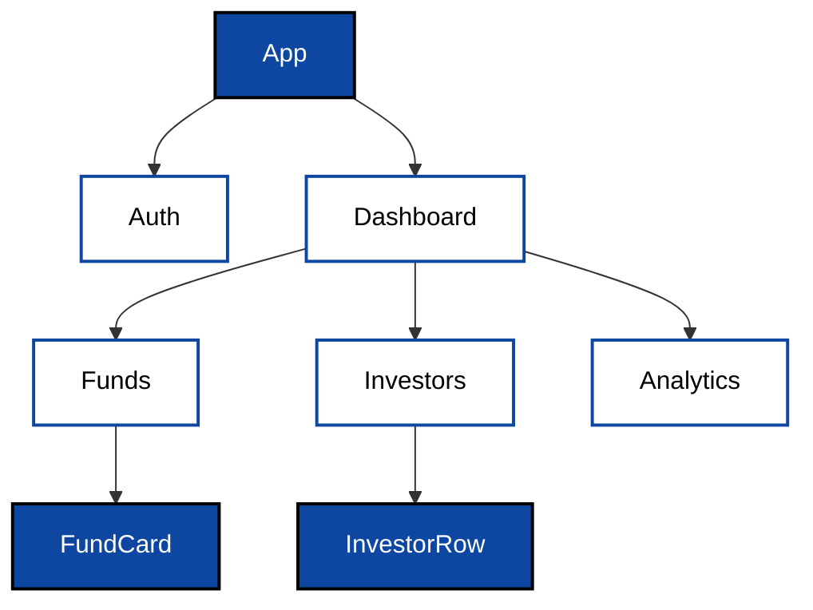

---

## 🔔 Notification System

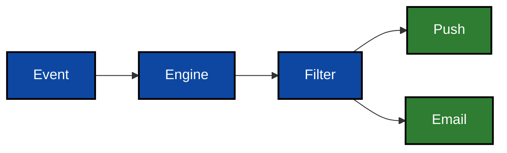

---

## 📉 Risk Management

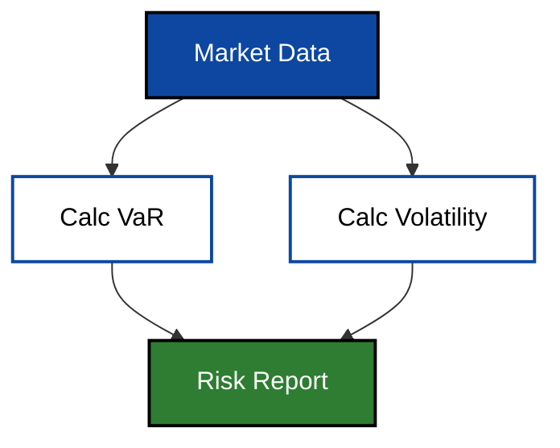

---

## 📝 Audit Trail

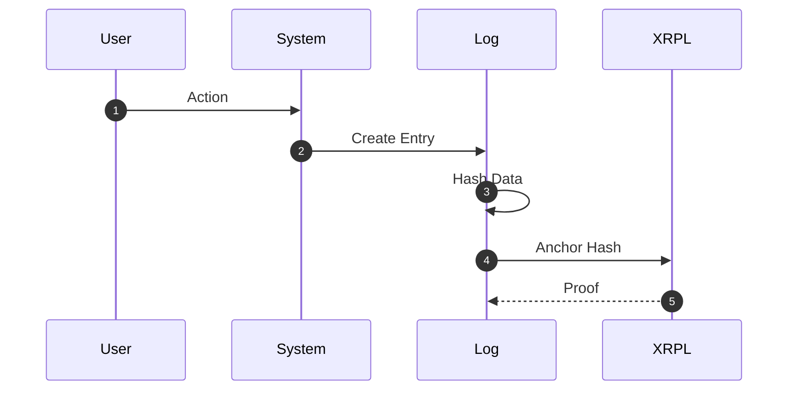

---

## 🛠️ Getting Started

### Prerequisites
- **Node.js v18+**
- **npm** or **yarn**

### Installation

```bash
# Clone the repository
git clone https://github.com/MrDecryptDecipher/xrpl-institutional-fund-management.git

# Install dependencies
npm install

# Start the development server
npm run dev
```

### Testing

```bash
# Run all tests
npm test

# Run specific integration tests
npm run test:integration
```

---

## 📄 License

This project is licensed under the MIT License - see the [LICENSE](LICENSE) file for details.