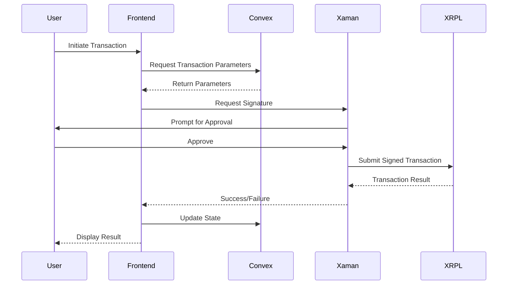

# System Architecture

## Overview
The XRPL Institutional Fund Management system is designed to facilitate secure and efficient fund management on the XRP Ledger. It integrates with Convex for backend services and Xaman (formerly Xumm) for wallet interactions.

## Component Interaction

```mermaid
graph TD
    User[User] -->|Interacts| Frontend[Frontend (React/Vite)]
    Frontend -->|Auth/Sign| Xaman[Xaman Wallet]
    Frontend -->|Data/Logic| Convex[Convex Backend]
    Convex -->|Query/Transact| XRPL[XRP Ledger]
    Xaman -->|Sign Tx| XRPL
```

## Data Flow



## Directory Structure

- `src/`: Source code for the React frontend.
- `convex/`: Backend functions and schema.
- `scripts/`: Utility and test scripts.
- `tests/`: Automated tests.
- `docs/`: Documentation.
- `legacy_docs/`: Archived reports and documentation.
- `legacy_scripts/`: Archived scripts.
